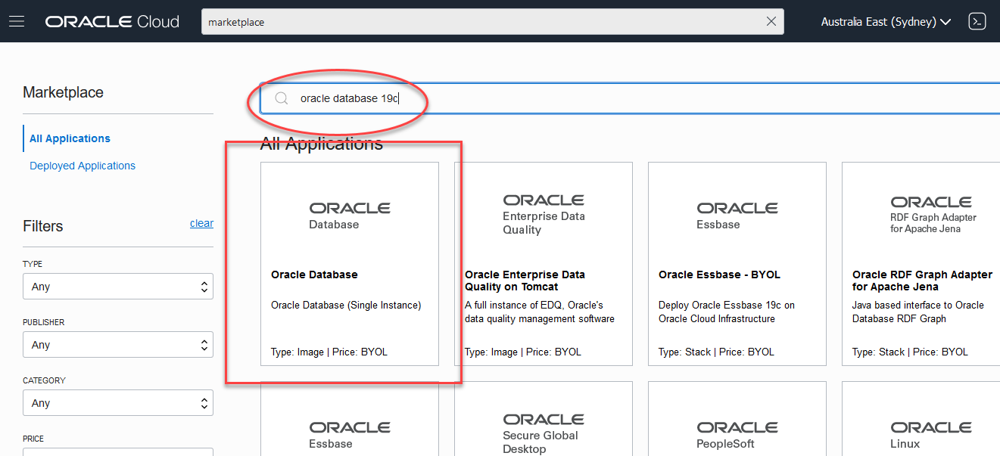
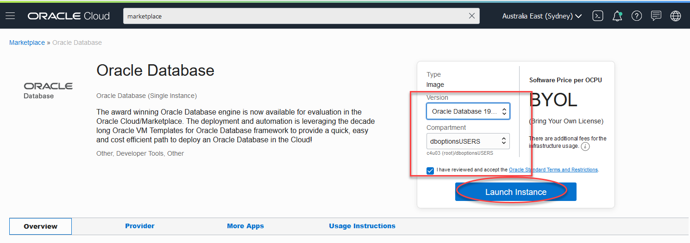
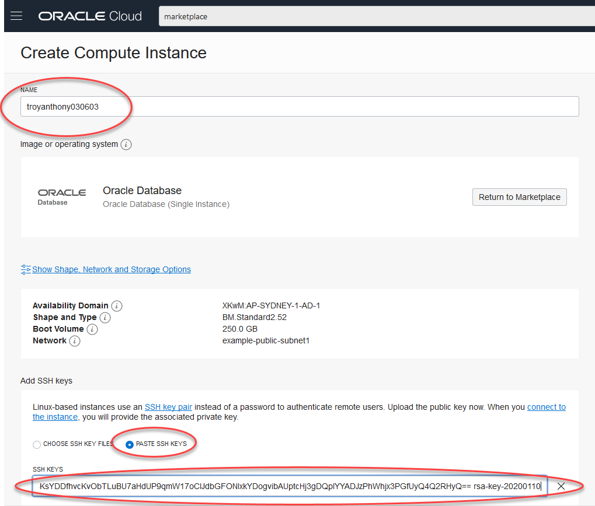
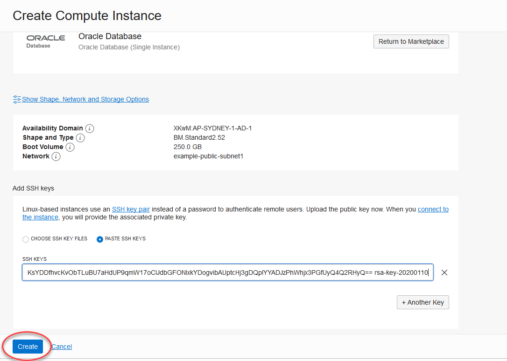
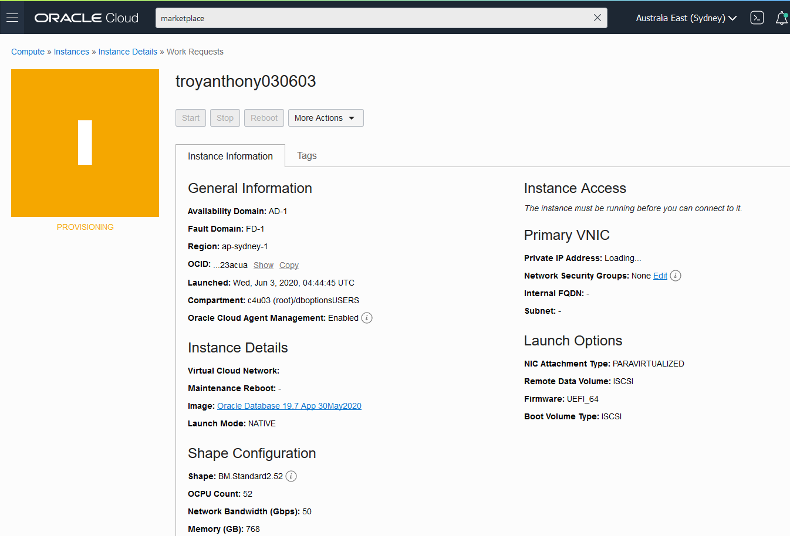
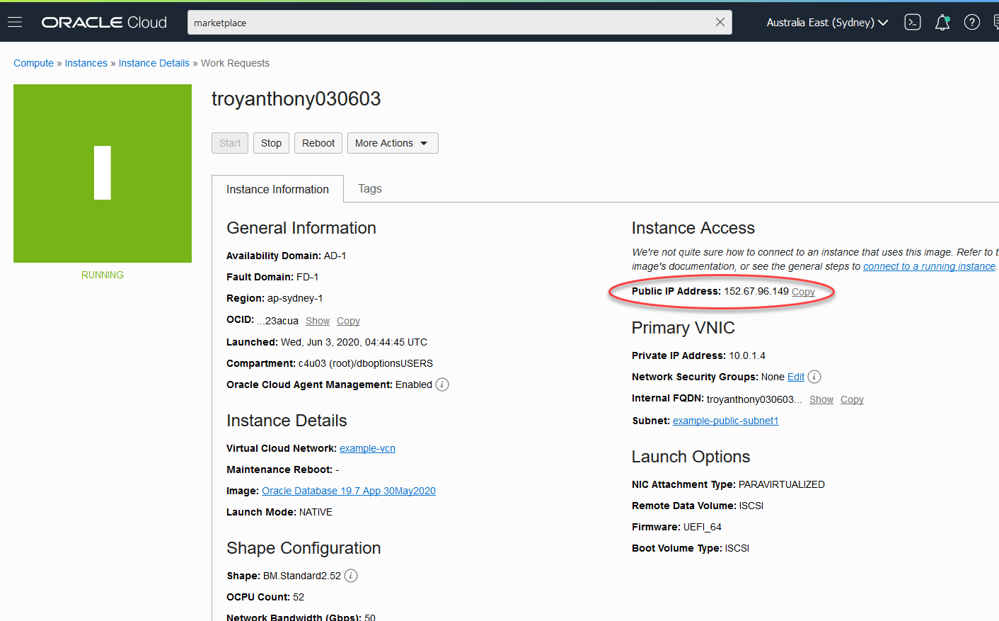
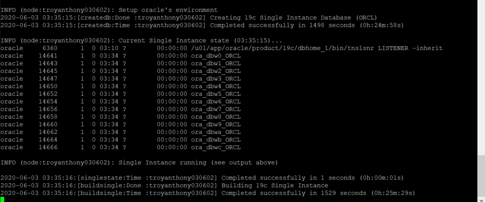

# Setup - Freetier or Existing Cloud Account

## Introduction
This lab will show you how to setup a Oracle Cloud network (VCN) and a compute instance running a pre-configured Oracle Database 19c install using an image from the Oracle Marketplace.  

### Oracle Cloud Marketplace

The Oracle Cloud Marketplace is a catalog of solutions that extends Oracle Cloud services.  It offers multiple consumption modes and deployment modes.  In this lab we will be deploying the free Oracle Database 19c marketplace image.

Link to Marketplace - [https://www.oracle.com/cloud/marketplace/](https://www.oracle.com/cloud/marketplace/)

### Objectives

-   Setup a network and compute instance using the DB19c Marketplace image

### Lab Prerequisites

This lab assumes you have already completed the following labs:
- Register for Free Tier
- Create SSH Keys

## Step 1: Download the Oracle Database (single instance) image from the Oracle Cloud Marketplace

1.  Open the cloud console and type *marketplace* in the search bar. Select the *Applications* link under the heading *Services*
    

2.  Enter *oracle database 19c* in the search bar and select the image *Oracle Database Oracle Database (single image)*.
    
    *Note* that you can directly access the image page via the address

    ```
    <copy>
    https://console.YOUR-REGION.oraclecloud.com/marketplace/application/47726045/overview)
    </copy>
    ```

3.  From the Pull-down menu on the right, choose Oracle Database 19.x, a compartment (in which to create your compute instance) and agree to the terms and conditions. Click **Launch Instance**
       

4.  Enter the following information:

    **Choose a Name for your Instance:** Enter a display name. This will be the display name for the compute instance you create.  We recommend your name and a set of numbers

    **SSH Public Key**:  Paste the public key you created in the earlier lab *(Note: If you used the Oracle Cloud Shell to create your key, make sure you paste the pub file in a notepad, remove any hard returns.  The file should be one line or you will not be able to login to your compute instance)*

          

6. When added Click **Create**

    

7.  Your Compute Instance will begin **Provisioning**

    


## Step 2: Connect to the Compute Instance
Once the Compute Instance has been provisioned and is **RUNNING** you can connect to it and verify the database has been created
    

You will need the Public IP Address assigned to your Instance

Choose the environment where you created your ssh-key in the previous lab (Generate SSH Keys)

*NOTE 1:  If you are using your laptop to connect your corporate VPN may prevent you from logging in.*

*NOTE 2: The ssh-daemon is disabled for the first 5 minutes or so while the instance is processing.  If you are unable to connect and sure you have a valid key, wait a few minutes and try again.*

### Oracle Cloud Shell

1. To re-start the Oracle Cloud shell, go to your Cloud console and click the cloud shell icon to the right of the region.  *Note: Make sure you are in the region you were assigned*

    

2.  Go to **Compute** -> **Instance** and select the instance you created (make sure you choose the correct compartment)
3.  On the instance homepage, find the Public IP addresss for your instance.
4.  Enter the command below to login to your instance.    
    ````
    ssh -i ~/.ssh/<sshkeyname> opc@<Your Compute Instance Public IP Address>
    ````

    *Note: You may recieve an error that the connection was refused. If you recieve this error wait a minute and re enter the previous command.*
5.  When prompted, answer **yes** to continue connecting.
6.  Continue to Step 5 on the left hand menu.

### MAC or Windows CYGWIN Emulator
1.  Go to **Compute** -> **Instance** and select the instance you created (make sure you choose the correct compartment)
2.  On the instance homepage, find the Public IP addresss for your instance.

3.  Open up a terminal (MAC) or cygwin emulator as the opc user.  Enter yes when prompted.

    ````
    ssh -i ~/.ssh/optionskey opc@<Your Compute Instance Public IP Address>
    ````
    

    

4.  After successfully logging in, proceed to Step 5.

### Windows using Putty

1.  Open up putty and create a new connection.

    ````
    ssh -i ~/.ssh/optionskey opc@<Your Compute Instance Public IP Address>
    ````
    

2.  Enter a name for the session and click **Save**.

    

3. Click **Connection** > **Data** in the left navigation pane and set the Auto-login username to root.

4. Click **Connection** > **SSH** > **Auth** in the left navigation pane and configure the SSH private key to use by clicking Browse under Private key file for authentication.

5. Navigate to the location where you saved your SSH private key file, select the file, and click Open.  NOTE:  You cannot connect while on VPN or in the Oracle office on clear-corporate (choose clear-internet).

    

6. The file path for the SSH private key file now displays in the Private key file for authentication field.

7. Click Session in the left navigation pane, then click Save in the Load, save or delete a stored session Step.

8. Click Open to begin your session with the instance.


## Step 3: Verify the database setup has completed

1.  From your connected session (either Putty, Cloud Shell, CYGWIN) **tail** the **dbsingle.log** file
````
<copy>
tail -f /u01/ocidb/buildsingle1.log
</copy>
````
    

2. When you see the following message the database setup is complete **Completed successfully in XXXX seconds** (this may take up to 25 minutes)

    

3. Connect to the Database using SQL*Plus as the **oracle** user
````
<copy>
sudo su - oracle
sqlplus system/Ora_DB4U@localhost:1521/orclpdb
</copy>
````
    


You may now proceed to the next lab.  

## Acknowledgements

- **Author** - Kay Malcolm, Director, DB Product Management
- **Last Updated By/Date** - Troy Anthony, June 2020

See an issue?  Please open up a request [here](https://github.com/oracle/learning-library/issues).   Please include the workshop name and lab in your request.    Please include the workshop name and lab in your request.
