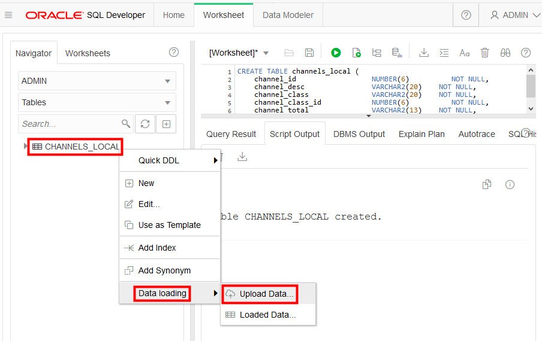
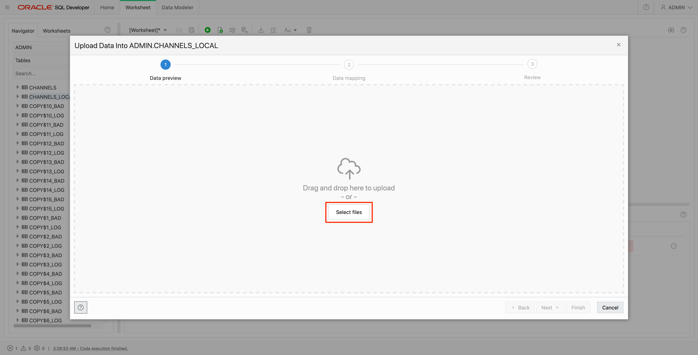
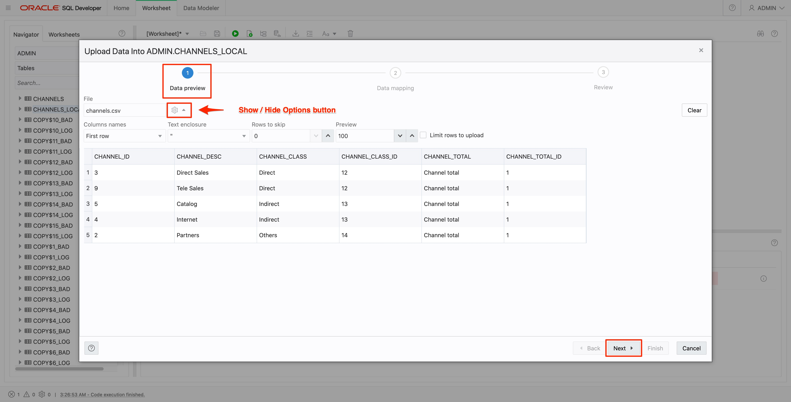
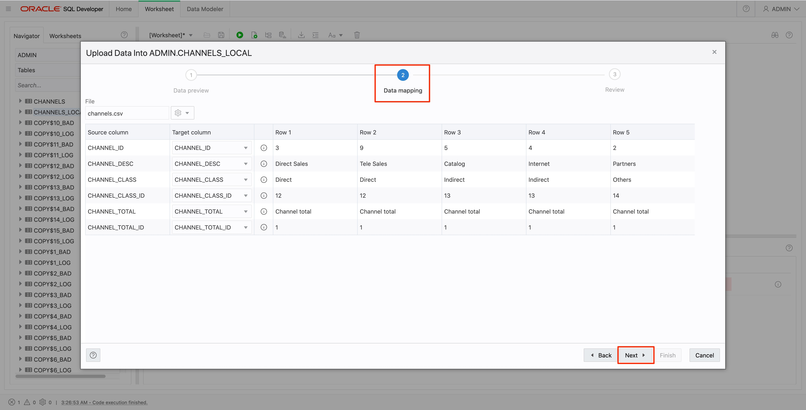
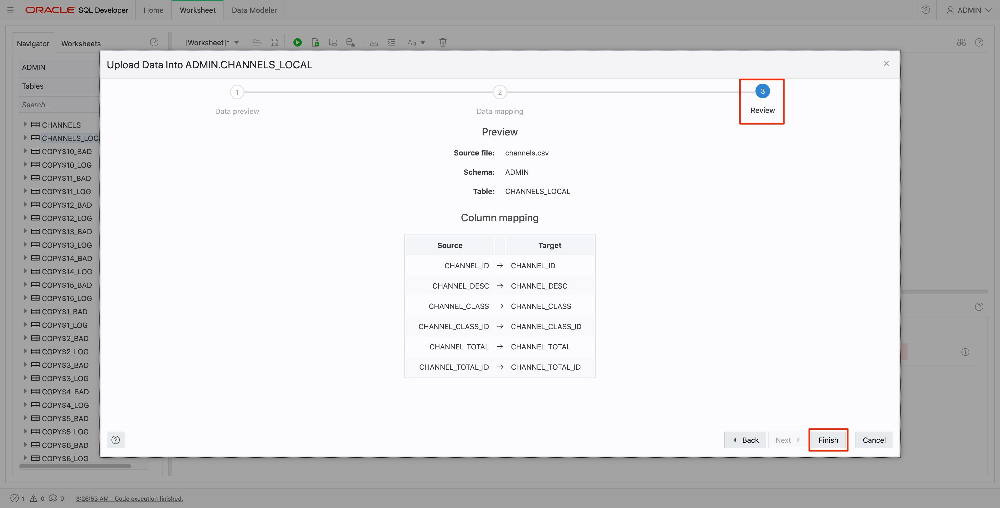
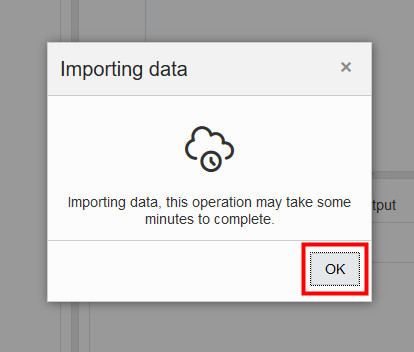
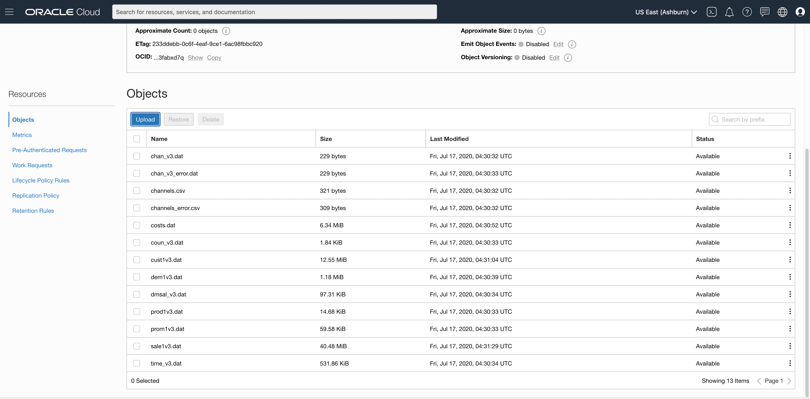

# Loading Data into an Autonomous Database Instance

## **Introduction**

In this lab, you will upload files to the Oracle Cloud Infrastructure (OCI) Object Storage, create sample tables, load data into them from files on the OCI Object Storage, and troubleshoot data loads with errors.

You can load data into your new autonomous database (Autonomous Data Warehouse [ADW] or Autonomous Transaction Processing [ATP]) using Oracle Database tools, and Oracle and 3rd party data integration tools. You can load data:

+ from local files in your client computer, or
+ from files stored in a cloud-based object store

For the fastest data loading experience, Oracle recommends uploading the source files to a cloud-based object store, such as *Oracle Cloud Infrastructure Object Storage*, before loading the data into your ADW or ATP database.

To load data from files in the cloud into your autonomous database, use the new PL/SQL *`DBMS_CLOUD`* package. The `DBMS_CLOUD` package supports loading data files from the following Cloud sources: Oracle Cloud Infrastructure Object Storage, Oracle Cloud Infrastructure Object Storage Classic, Amazon AWS S3, and Microsoft Azure Object Store.

This lab shows how to load data from Oracle Cloud Infrastructure Object Storage using two of the procedures in the `DBMS_CLOUD` package:

+ **create_credential**: Stores the object store credentials in your Autonomous Data Warehouse schema.
    + You will use this procedure to create object store credentials in your ADW admin schema.
+ **copy_data**: Loads the specified source file to a table. The table must already exist in ADW.
    + You will use this procedure to load tables to your admin schema with data from data files staged in the Oracle Cloud Infrastructure Object Storage cloud service.

*Note: While this lab uses ADW, the steps are identical for loading data into an ATP database.*

### Objectives

-   Learn how to use SQL Developer Web to load data into an autonomous database table
-   Learn how to upload files to the OCI Object Storage
-   Learn how to define object store credentials for your autonomous database
-   Learn how to create tables in your database
-   Learn how to load data from the Object Store
-   Learn how to troubleshoot data loads

In Steps 1 and 2, you will create one ADW table, **CHANNELS_LOCAL**, and load it with sample data from your *local file system*. In the remaining steps, you will create several ADW tables and load them with sample data that you stage to an *OCI Object Store*.

### Lab Prerequisites
- The following lab requires an <a href="https://www.oracle.com/cloud/free/" target="\_blank"> Oracle Cloud account</a>. You may use your own cloud account, a cloud account that you obtained through a trial, a LiveLabs account or a training account whose details were given to you by an Oracle instructor.

- This lab assumes you have completed the **Prerequisites** and **Lab 1** seen in the Contents menu on the right.


## **STEP 1**: Download Sample Data and Create Local Table

1. For this step, you will download a .csv file to your local computer, then use it to populate the CHANNELS_LOCAL table that you will create in your ADW database in the next step.  Click <a href="https://objectstorage.us-ashburn-1.oraclecloud.com/p/A5zXkuuOG2C5AOBHTiVpJd3obiECvsk8omPtnzvTwP0/n/c4u03/b/data-management-library-files/o/channels.csv" target="\_blank">here</a> to download the sample channels.csv file, saving it to a directory on your local computer.

2. In your Autonomous Database Details page, click the **Tools** tab. Click **Open SQL Developer Web**.

    

3. To define the CHANNELS_LOCAL table, click <a href="./files/define_channels_local_table.txt" target="\_blank">here</a> to copy or download the table creation code snippet. Then paste it into the SQL Developer Web worksheet and click the **Run Script** button to run it.

    

## **STEP 2**: Load Local Data Using SQL Developer Web

1. In the Navigator, **right-click** your new CHANNELS_LOCAL table. You might need to refresh the Navigator to see the new table. In the menu, select **Data loading → Upload Data...**:

    

2. The Data Import Wizard is started. Perform the following:

    -   Click **Select files** to select the file for data uploading.

    -   Click the browse button and navigate to the channels.csv file that you downloaded in Step 1.
  
    -   Or, you can drag and drop the channels.csv file

        

3. After you select the file, the wizard provides a **Data preview** step. You can click the **Show/Hide options** button to perform actions including skipping rows and limiting rows to upload. Use the horizontal toolbar to check the data.

4. When you are satisfied with the file's data, click **Next**.

    
<!--When newline is fixed -->

  *Note: If your source .csv file has delimiters other than commas between words, or line delimiters other than new-line characters, you will need to use SQL Developer for now, rather than SQL Developer Web.*

5. In Step 2 of the Import Wizard, **Data mapping**, you can change the source-to-target column mappings. For this exercise, leave them as default and click **Next**.

    

6.  The final step of the Import Wizard, **Review**, reflects all of the choices you made in the Wizard. Click **Finish** to load the data into your newly created table *CHANNELS_LOCAL*. 
    

7. Click **OK** to confirm the import. Depending on the size of the data file you are importing, the import may take some time. After importing finishes, you can expand the *CHANNELS_LOCAL* table to see the data being imported. If you don't see your table or your data in your object tree under Tables, click the refresh button.

    
    

## **STEP 3**: Download Sample Data and Create Target Tables

In Steps 1 and 2, you created an ADW table and loaded it with sample data from your local file system. Now, you will create several ADW tables and load them with sample data that you stage to an *OCI Object Store*.

<!-- The data file is located in the c4u03 Object Store. This PAR link is good through June 23, 2025 -->
1. For this step, you will need a handful of data files.  Click <a href="https://objectstorage.us-ashburn-1.oraclecloud.com/p/gDf44URh0sFPADBZo7fp6wIgXb-0PO5ZadFQTq2nqNo/n/c4u03/b/data-management-library-files/o/adb_sample_data_files.zip" target="\_blank">here</a> to download a zip file of the sample source files for you to upload to the object store. Unzip it to a directory on your local computer.

2. Connected as your ADMIN user in SQL Developer Web, copy and paste <a href="./files/create_tables.txt" target="\_blank">this code snippet</a> to a worksheet. Take a moment to examine the script. You will first drop any tables with the same name before creating tables. Then click the **Run Script** button to run it.

      -  It is expected that you may get *ORA-00942 table or view does not exist* errors during the DROP TABLE commands for the first execution of the script, but you should not see any other errors.

       

*Note that you do not need to specify anything other than the list of columns when creating tables in the SQL scripts. You can use primary keys and foreign keys if you want, but they are not required.*

## **STEP 4**: Navigate to Object Storage and Create Bucket

In OCI Object Storage, a bucket is the terminology for a container of multiple files.

1. Now you set up the OCI Object Store. From the Autonomous Data Warehouse console, pull out the left side menu from the top-left corner and select **Object Storage > Object Storage**. To revisit signing-in and navigating to ADW, please see [Lab 1](?lab=lab-1-provision-autonomous-database).

  

  *To learn more about the OCI Object Storage, refer to its <a href="https://docs.us-phoenix-1.oraclecloud.com/Content/GSG/Tasks/addingbuckets.htm" target="\_blank">documentation</a>*

2. You should now be on the **Object Storage** page. Choose any compartment to which you have access. In this example, the **root** compartment is chosen.
    

3. Click the **Create Bucket** button:

    

4. Bucket names must be unique per tenancy and region; otherwise you will receive an "already exists" message. Enter a unique bucket name and click the **Create Bucket** button.

    

## **STEP 5**: Upload Files to Your OCI Object Store Bucket

1. Click your **bucket name** to open it:

    

2. Click the **Upload** button:

    

3. Drag and drop, or click  **select files**,  to select all the files downloaded in Step 3. Click **Upload** and wait for the upload to complete:

    

4. The end result should look like this with all files listed under Objects:

    

## **STEP 6**: Object Store URL

1. Locate the base URL of the objects in your object store. The simplest way to get this URL is from the "Object Details" in the right hand side ellipsis menu in the Object Store.

    

2.  Copy the base URL that points to the location of your files staged in the OCI Object Storage. *Do not include the trailing slash.* Save the base URL in a text notepad. We will use the base URL in the upcoming steps.

    

3. Take a look at the URL you copied. In this example above, the **region name** is us-ashburn-1, the **Namespace** is c4u03, and the **bucket name** is ADWCLab.

    *Note: The URL can also be constructed as below:*

    `https://objectstorage.<`**region name**`>.oraclecloud.com/n/<`**namespace name**`>/b/<`**bucket name**`>/o`

## **STEP 7**: Creating an Object Store Auth Token

To load data from the Oracle Cloud Infrastructure (OCI) Object Storage, you will need an OCI user with the appropriate privileges to read data (or upload) data to the Object Store. The communication between the database and the object store relies on the native URI, and the OCI user Auth Token.

1. Locate your menu bar and click on the **person icon** at the far upper right.  From the drop-down menu, select your **user's name** (remember this username could be an email).

    

    

    *Note: If you don't see your user name in the drop-down menu, you might be a "federated" user. In that case, go instead to the menu on the left side and open Users. Federated users are “federated” from another user service, whether it is an Active Directory LDAP type service or users from the older OCI Classic.*

2. Click the **user's name** to view the details.  Also, remember the username as you will need that in the next step. This username could also be an email address.

    

3. On the left side of the page, click **Auth Tokens**.

    

4. Click **Generate Token**.

    

5. Enter a meaningful **description** for the token and click **Generate Token**.

    

6.  The new Auth Token is displayed. Click **Copy** to copy the Auth Token to the clipboard. Save the contents of the clipboard in your text notepad file. You will use it in the next steps. *Note: You can't retrieve the Auth Token again after closing the dialog box.*

    

7. Click **Close** to close the Generate Token dialog.

## **STEP 8**: Create a Database Credential for Your User

In order to access data in the Object Store, you have to enable your database user to authenticate itself with the Object Store using your OCI object store account and Auth Token. You do this by creating a private *CREDENTIAL* object for your user that stores this information encrypted in your Autonomous Data Warehouse. This information is only usable for your user schema.

1. Connected as your ADMIN user in SQL Developer Web, copy and paste <a href="./files/create_credential.txt" target="\_blank">this code snippet</a> to a SQL Developer Web worksheet.

    - **username** - Replace `<Username>` with the **OCI Username** as shown in Step 7.
    - **password** - Replace `<Auth Token>` with the OCI Object Store **Auth Token** you generated in Step 7.

    *Note: Be sure that you keep the single quotes!*

    

2. Run the script.

    

3.  Now you are ready to load data from the Object Store.

## **STEP 9**: Loading Data from the Object Store Using the PL/SQL Package, DBMS_CLOUD

As an alternative to the wizard-guided data load, you can use the PL/SQL package **DBMS_CLOUD** directly. This is the preferred choice for any load automation.

1. Download <a href="./files/load_data_without_base_url.txt" target="\_blank">this code snippet</a> to a text editor.

2. Replace `<file_uri_base>` in the code with the base URL you copied in Step 6. You should make 10 substitutions. The top of the file should look similar to the example below:

    ```
    begin
     dbms_cloud.copy_data(
        table_name =>'CHANNELS',
        credential_name =>'OBJ_STORE_CRED',
        file_uri_list =>'https://objectstorage.us-ashburn-1.oraclecloud.com/n/c4u03/b/ADWCLab/o/chan_v3.dat',
        format => json_object('ignoremissingcolumns' value 'true', 'removequotes' value 'true')
     );
    end;
    ...
    ```

3.  Copy and paste your edited file to a SQL Developer Web worksheet. This script uses the **copy\_data** procedure of the **DBMS\_CLOUD** package to copy the data from the source files to the target tables you created before.

4.  Run the script.

    

5.  You have successfully loaded the sample tables. You can now run any sample query in the <a href="https://docs.oracle.com/database/122/DWHSG/part-relational-analytics.htm#DWHSG8493" target="\_blank">relational analytics</a> section of the Oracle documentation. For example, to analyze the cumulative amount sold for specific customer IDs in a quarter in 2000, you could run the query in <a href="./files/query_tables.txt" target="\_blank">this code snippet</a> using the Run Script button.   <a href="https://docs.oracle.com/en/database/oracle/oracle-database/12.2/dwhsg/introduction-data-warehouse-concepts.html#GUID-452FBA23-6976-4590-AA41-1369647AD14D" target="\_blank">Click Here</a> to read more about Data Warehousing.

    

## **STEP 10**: Troubleshooting DBMS_CLOUD data loads

1. Connected as your user in SQL Developer Web, run the following query to look at past and current data loads.
    ```
    $ <copy>select * from user_load_operations;
    line 2
    line 3
    line x
    </copy>
    ```
    *Notice how this table lists the past and current load operations in your schema.  Any data copy and data validation operation will have backed-up records in your Cloud.*

2. For an example of how to troubleshoot a data load, we will attempt to load a data file with the wrong format (chan\_v3\_error.dat).  Specifically, the default separator is the | character, but the channels_error.csv file uses a semicolon instead.  To attempt to load bad data, copy and paste <a href="./files/load_data_with_errors.txt" target="\_blank">this code snippet</a> to a SQL Developer Web worksheet and run the script as your user in SQL Developer Web. Specify the URL that points to the **chan\_v3\_error.dat** file. Use the the URL that you have copied and saved in Step 6. Expect to see "Reject limit" errors when loading your data this time.

    

3. Run the following query to see the load that errored out.
    ```
    <copy>select * from user_load_operations where status='FAILED';</copy>
    ```

    

    A load or external table validation that errors out is indicated by *status=FAILED* in this table. Get the names of the log and bad files for the failing load operation from the column **logfile\_table** and **badfile\_table**. The `logfile_table` column shows the name of the table you can query to look at the *log* of a load operation. The column `badfile_table` shows the name of the table you can query to look at the *rows that got errors* during loading.

4. Query the log and bad tables to see detailed information about an individual load. In this example, the names are `copy$21_log` and `copy$21_bad` respectively.

        

5.  To learn more about how to specify file formats, delimiters, reject limits, and more, review the <a href="https://docs.oracle.com/en/cloud/paas/autonomous-data-warehouse-cloud/user/dbmscloud-reference.html" target="\_blank"> Autonomous Database Supplied Package Reference </a> and <a href="https://docs.oracle.com/en/cloud/paas/autonomous-data-warehouse-cloud/user/format-options.html#GUID-08C44CDA-7C81-481A-BA0A-F7346473B703" target="\_blank"> DBMS_CLOUD Package Format Options </a>

Please *proceed to the next lab*.

## Want to Learn More?

For more information about loading data, see the documentation [Loading Data from Files in the Cloud](https://www.oracle.com/pls/topic/lookup?ctx=en/cloud/paas/autonomous-data-warehouse-cloud&id=CSWHU-GUID-07900054-CB65-490A-AF3C-39EF45505802).

Click [here](https://docs.oracle.com/en/cloud/paas/autonomous-data-warehouse-cloud/user/load-data.html#GUID-1351807C-E3F7-4C6D-AF83-2AEEADE2F83E) for documentation on loading data with Autonomous Data Warehouse.

## **Acknowledgements**

- **Author** - Nilay Panchal, ADB Product Management
- **Adapted for Cloud by** - Richard Green, Principal Developer, Database User Assistance
- **Last Updated By/Date** - Arabella Yao, Product Manager Intern, DB Product Management, July 2020

## **See an issue?**
Please submit feedback using this [form](https://apexapps.oracle.com/pls/apex/f?p=133:1:::::P1_FEEDBACK:1). Please include the *workshop name*, *lab* and *step* in your request.  If you don't see the workshop name listed, please enter it manually. If you would like for us to follow up with you, enter your email in the *Feedback Comments* section.
