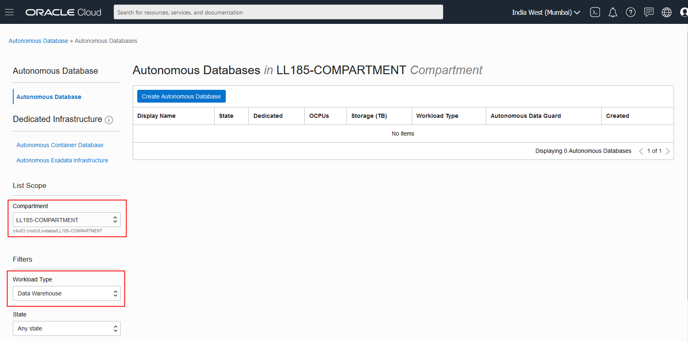
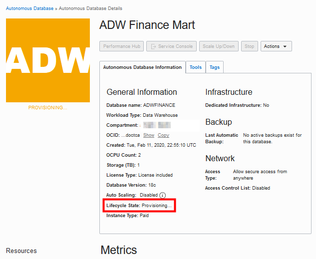

# Provisioning Autonomous Database (ADW and ATP)

## Introduction

This lab walks you through the steps to get started using the Oracle Autonomous Database (Autonomous Data Warehouse [ADW] and Autonomous Transaction Processing [ATP]) on Oracle Cloud. You will provision a new ADW instance and connect to the database using the Oracle SQL Developer Web.

*Note: While this lab uses ADW, the steps are identical for creating and connecting to an ATP database.*

Watch a video demonstration of provisioning a new Autonomous Data Warehouse:

### Objectives

- Learn how to provision a new Autonomous Data Warehouse

### Required Artifacts

- The following lab requires an <a href="https://www.oracle.com/cloud/free/" target="\_blank">Oracle Cloud Account</a>. You may use your own cloud account, a cloud account that you obtained through a trial, a Free Tier account, or a training account whose details were given to you by an Oracle instructor.

### Lab Prerequisites

- This lab assumes you have already completed the [Log in to Oracle Cloud] (?lab=lab-0-login-oracle-cloud) lab seen in the menu on the right. In this lab, you will be provisioning an ADB database instance using the cloud console.

## STEP 1: Choosing ADW or ATP from the Services Menu

1.  Log in to the Oracle Cloud.

2.  Once you are logged in, you are taken to the cloud services dashboard where you can see all the services available to you. Click the navigation menu in the upper left to show top-level navigation choices.

    __Note:__ You can also directly access your Autonomous Data Warehouse or Autonomous Transaction Processing services in the __Quick Actions__ section of the dashboard.

    

3.  The following steps apply similarly to either Autonomous Data Warehouse or Autonomous Transaction Processing. This lab shows provisioning of an Autonomous Data Warehouse Database, so click on **Autonomous Data Warehouse**.

    

4.  Under List Scope, click on __Compartment__ drop-down menu to select a compartment. Select your __root compartment__ or __another compartment of your choice__ where you will create your new ADW instance. If you want to create a new compartment or learn more about them, click <a href="https://docs.cloud.oracle.com/iaas/Content/Identity/Tasks/managingcompartments.htm#three" target="\_blank">here</a>.

    __Note__ - Avoid the use of the ManagedCompartmentforPaaS compartment as this is an Oracle default used for Oracle Platform Services.

    

5.  Make sure your Workload Type is __Data Warehouse__ or __All__ to see your Autonomous Data Warehouse instances. Here, the **Data Warehouse** workload type is selected.

    

6.  In this example, console shows that there are no databases in the train compartment. If there were a long list of databases, you could filter the list by the State of the databases (available, stopped, terminated, and so on). You can also sort by Workload Type. Here, the Data Warehouse workload type is selected in train compartment.

    

7.  You can see your current default **Region** in the top right-hand corner of the console page. Go ahead and select a different available region such as **Phoenix** or **Toronto**.

    

## STEP 2: Creating the ADB Instance

1.  Click **Create Autonomous Database** to start the instance creation process.

    

2.  On the __Create Autonomous Database__ screen, you will specify configuration information for the ADB instance.

    Provide basic information for the Autonomous Database:

    - __Compartment__ - Select a compartment for the database from the drop-down list.
    - __Display Name__ - Enter a memorable name for the database for display purposes. For this lab, use __ADW Finance Mart__.
    - __Database Name__ - Enter a database name starting with a letter. Only use letters and numbers with maximum length up to 14 characters (Underscores are not supported). For this lab, use __ADWFINANCE__.

    

3.  Select the workload type for your database from the choices.

    Choose a workload type:

    - __Data Warehouse__ - For this lab, choose __Data Warehouse__ as the workload type.
    - __Transaction Processing__ - Alternately, you could have chosen Transaction Processing as the workload type.

    

4.  Select the deployment type for your database from the choices.

    Choose a deployment type:

    - __Shared Infrastructure__ - For this lab, choose __Shared Infrastructure__ as the deployment type.
    - __Dedicated Infrastructure__ - Alternately, you could have chosen Dedicated Infrastructure as the deployment type.

    

5.  Configure the database:

    - __Always Free__ - You can select this option to create an always free autonomous database, or not select this option and create a database using your paid subscription. An always free database comes with 1 CPU and 20 GB of storage.
    - __Choose database version__ - Select a database version from the available versions. For this lab, choose __19c database version__.
    - __OCPU count__ - Number of CPUs for your service. For this lab, specify __2 CPUs__. Or, if you choose an always free database, it comes with 1 CPU.
    - __Storage (TB)__ - Select your storage capacity in terabytes. For this lab, specify __1 TB__ of storage. Or, if you choose an always free database, it comes with 20 GB of storage.
    - __Auto Scaling__ - For this lab, keep __Auto Scaling Enabled__, to allow the system to automatically use up to three times more CPU and IO resources to meet workload demand.
    - __New Database Preview__ - If a checkbox is available to preview a new database version, __Do not select it__.

    

6.  Create administrator credentials:

    - __Password and Confirm Password__ - Specify the password for __ADMIN__ user for the service instance. Make a note of this password.

    The password must meet the following requirements:
    - The password must be between 12 and 30 characters long and must include at least one uppercase letter, one lowercase letter, and one numeric character.
    - The password cannot contain the username.
    - The password cannot contain the double quote (") character.
    - The password must be different from the last 4 passwords used.
    - The password must not be the same password that is set less than 24 hours ago.
    - Re-enter the password to confirm it.

    

7.  Choose network access:

    - __Allow secure access from everywhere__ - For this lab, accept the default, __Allow secure access from everywhere__.
    - __Virtual cloud network__ - If you want a private endpoint to allow traffic only from the VCN, you specify where to access the database from all public IPs or VCNs is blocked, then select "Virtual cloud network".
    - __Configure access control rules__ - You can control and restrict access to your Autonomous Database by setting network Access Control Lists (ACLs). You can select from 4 IP notation types: IP Address, CIDR Block, Virtual Cloud Network, Virtual Cloud Network OCID).

    

8.  Choose a license type and then click __Create Autonomous Database__.

    - __Bring Your Own License (BYOL)__ - Select this type when your organization has existing database licenses.
    - __License Included__ - Select this type when you want to subscribe to new database software licenses and the database cloud service.  For this lab, choose __License Included__.

    

9.  Your instance will begin provisioning. In a few minutes, the state will turn from Provisioning to Available. At this point, your Autonomous Data Warehouse database is ready to use! Have a look at your instance's details here including its name, database version, CPU count, and storage size.

    

    

Please proceed to the next lab.

## Want to Learn More?

Click [here](https://docs.oracle.com/en/cloud/paas/autonomous-data-warehouse-cloud/user/autonomous-workflow.html#GUID-5780368D-6D40-475C-8DEB-DBA14BA675C3) for documentation on the typical workflow for using Autonomous Data Warehouse.

## Acknowledgements

- **Author** - Nilay Panchal, ADB Product Management
- **Adapted for Cloud by** - Richard Green, Principal Developer, Database User Assistance
- **Last Updated By/Date** - Richard Green, March 2020

See an issue?  Please open up a request [here](https://github.com/oracle/learning-library/issues).   Please include the workshop name and lab in your request.
