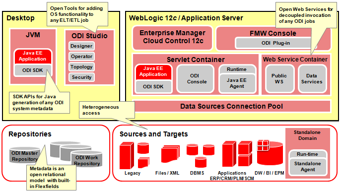

# Oracle Data Integrator

## Introduction
Oracle Data Integrator is a comprehensive data integration platform that covers all data integration requirements: from high-volume, high-performance batch loads, to event-driven, trickle-feed integration processes, to SOA-enabled data services. Oracle Data Integrator (ODI) 12c, the latest version of Oracle’s strategic Data Integration offering, provides superior developer productivity and improved user experience with a redesigned flow-based declarative user interface and deeper integration with Oracle GoldenGate. ODI12c further builds on its flexible and high-performance architecture with comprehensive big data support and added parallelism when executing data integration processes. It includes interoperability with Oracle Warehouse Builder (OWB) for a quick and simple migration for OWB customers to ODI12c. Additionally, ODI can be monitored from a single solution along with other Oracle technologies and applications through the integration with Oracle Enterprise Manager 12c.

    

Key reasons why companies choose Oracle Data Integrator for their data integration needs:
  * Faster and simpler development and maintenance
  * Data quality firewall
  * Better execution performance
  * Simple, efficient architecture
  * Platform Independence
  * Data Connectivity
  * Cost-savings

### Objectives

-  Get started with Oracle Data Integrator. General information and detailed examples to help you learn how to use Oracle Data Integrator.

### Required Artifacts

-   The following lab requires an <a href="https://www.oracle.com/cloud/free/" target="\_blank">Oracle Cloud account</a>. You may use your own cloud account, a cloud account that you obtained through a trial, or a training account whose details were given to you by an Oracle instructor.

### Lab Prerequisites
This lab assumes you have completed the following labs:
* Lab: [Login to Oracle Cloud]()
* Lab: [Provision an Autonomous Database containing an ODI repository]()

## Acknowledgements

 - **Author** - Jayant Mahto, July 2020
 - **Last Updated By/Date** - Troy Anthony, June 25 2020

 See an issue?  Please open up a request [here](https://github.com/oracle/learning-library/issues).   Please include the workshop name and lab in your request.
