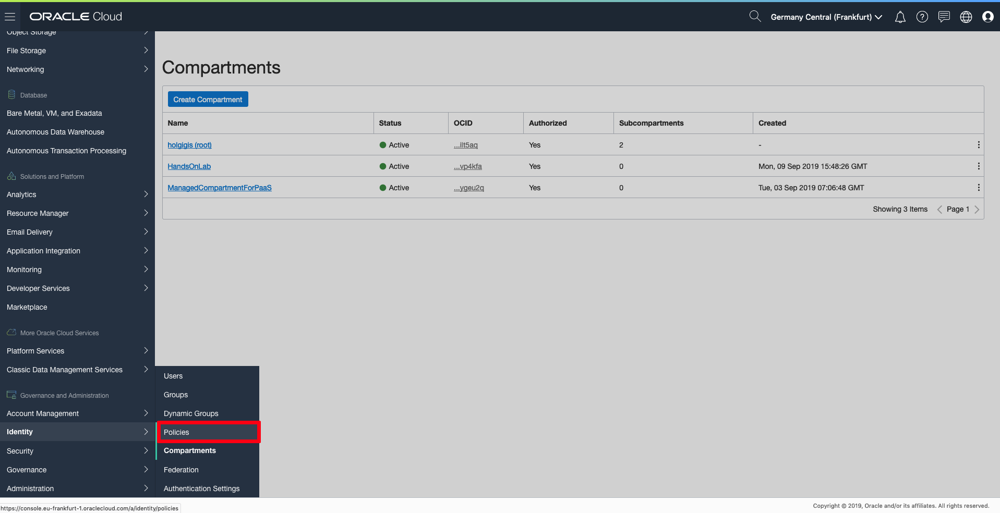
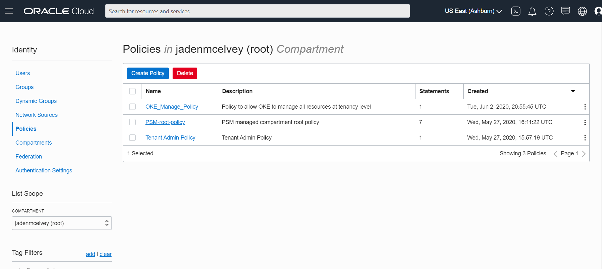
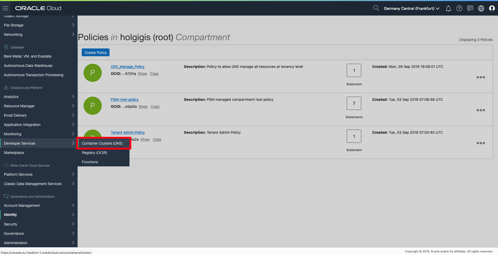
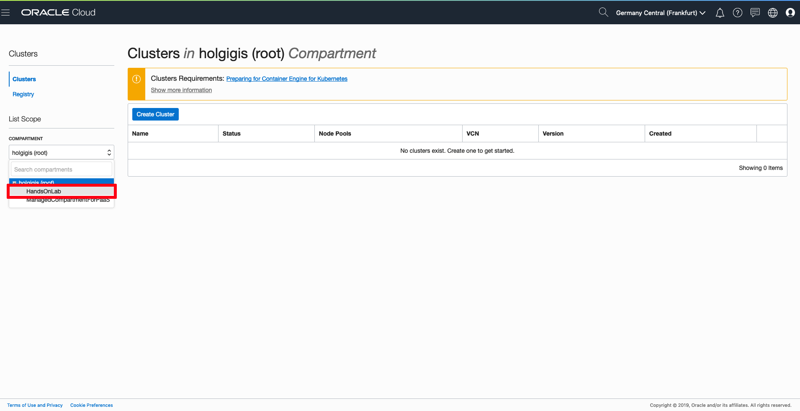
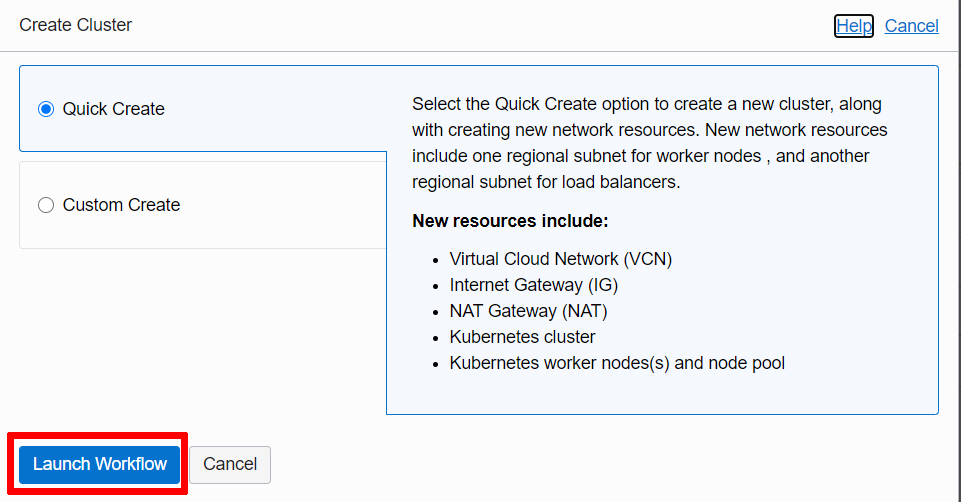
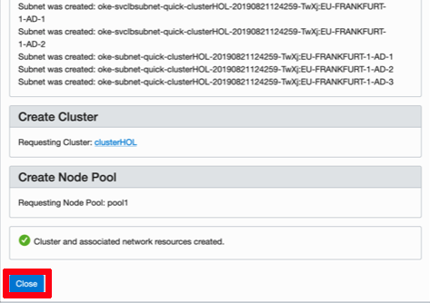
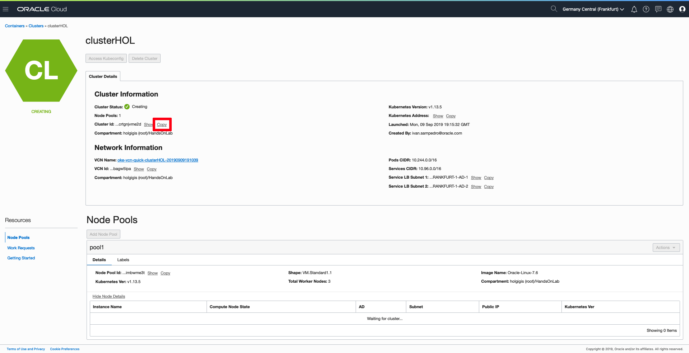
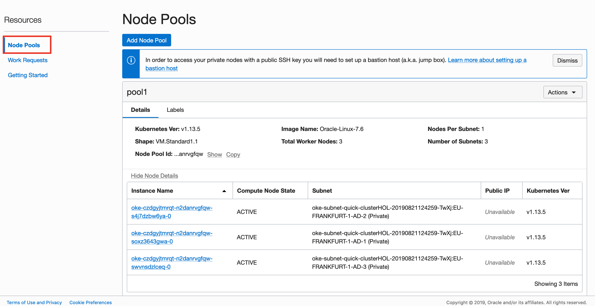
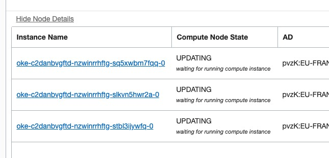

# Create a Kubernetes Cluster

## Before You Begin

In this lab you will create a Kubernetes Cluster to deploy the microservices you will create in a later lab.

## **Step 1**: Create Policies

1. Start by creating a policy that allows Service OKE to be created and manage all resources in this tenancy. To do this open the menu and go to Identity-\>Policies.

  

2. Check that the root compartment is selected. Then click **Create Policy** and fill in the name and description. Copy and paste the value below into the Policy Statements field:

  

   ```
   <copy>Allow service OKE to manage all-resources in tenancy</copy>
   ```

3. And then click **Create**:

  

4. Then check that the policy has been created:

  

## **Step 2**: Create OKE Clusters

1. In the OCI Dashboard Menu go to: Developer Services-\> Container Clusters (OKE)

  

2. Select the compartment you created in lab 2 under List Scope and click **Create Cluster**:

  

3. Provide a name for the cluster, then select the QUICK CREATE option and click the **Launch Workflow** button:

  

4. Select VM.Standard2.1 for SHAPE and 3 (or less if you don't want to create a 3 workernodes nodepool) for the NUMBER OF NODES (this number is the VMs that will be created into the node pool). Then click **NEXT**. Leave the rest of the parameters as defaults:

  

5. Review the cluster information before to create it, and click **Create Cluster** or back to modify cluster options:

  

6. The previous QUICK CREATE Option will setup a 3 nodes Kubernetes Cluster with predefined Virtual Cloud Network, 3 Subnets, Security Lists, Route tables. When you are done with checks, please click **Close**.

  *Note: Cluster creation process can take several minutes.*

  

  

7. Then you are taken to the Cluster Information page. Please copy Cluster id and don’t forget to make a note in a txt file as you will need this data later:

  

8. It will take several minutes for the cluster to be created and you may need to refresh the page. Once created, you can scroll down and select **Node Pools** under the Resources area, you can check that a node pool with three node clusters has been created:

  

  *Note: you may find that Compute nodes have not been created yet as. This process can take several minutes as compute instances have to be created and then started:*

  

9. Now your Kubernetes Cluster is created. But we need to run some extra steps to get started with managing the Kubernetes Cluster.

  Click **Quick Start** under the Resources area. This section explains the steps to access your Cluster dashboard by using Kubectl. It is also explains how to install OCIcli and kubectl to access to Kubernetes management tool:

  

  You can proceed to the next lab.

## Want to Learn More?

* [Oracle Developer Cloud Service Documentation](https://docs.oracle.com/en/cloud/paas/developer-cloud/index.html)
* [Oracle Container Engine for Kubernetes Documentation](https://docs.cloud.oracle.com/en-us/iaas/Content/ContEng/Concepts/contengoverview.htm)

## Acknowledgements
* **Authors** -  Iván Postigo, Jesus Guerra, Carlos Olivares - Oracle Spain SE Team
* **Contributors** - Jaden McElvey, Technical Lead - Oracle LiveLabs Intern
* **Last Updated By/Date** - Tom McGinn, April 2020

See an issue?  Please open up a request [here](https://github.com/oracle/learning-library/issues). Please include the workshop name and lab in your request.
