# Create and Configure a Developer Cloud Service Instance

## Before You Begin

In this lab you will provision an Oracle Developer Cloud Service instance, gather data from your Oracle Cloud Tenancy and use the data to configure your Developer Cloud Service instance

## **Step 1**: Provision a Developer Cloud Service instance

1. Click the hamburger icon on the top left side and select **Platform Services** (under More Oracle Cloud Services Area), then select **Developer**.

  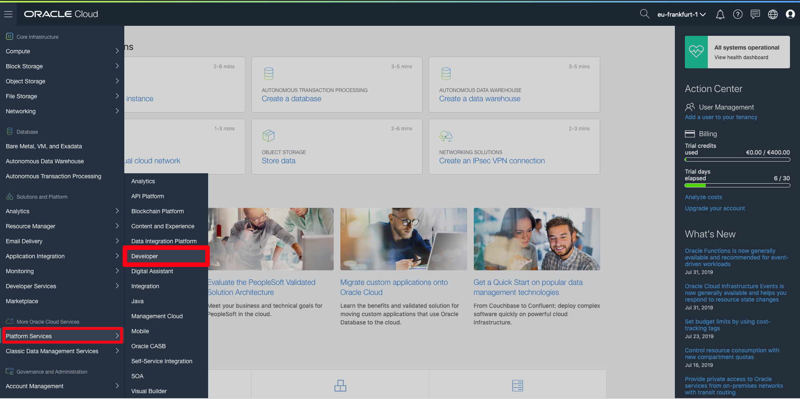

2. There you will be taken to Developer Cloud Service Welcome Page. Let’s start creating a DevCS instance. Click **Create Instance**.

  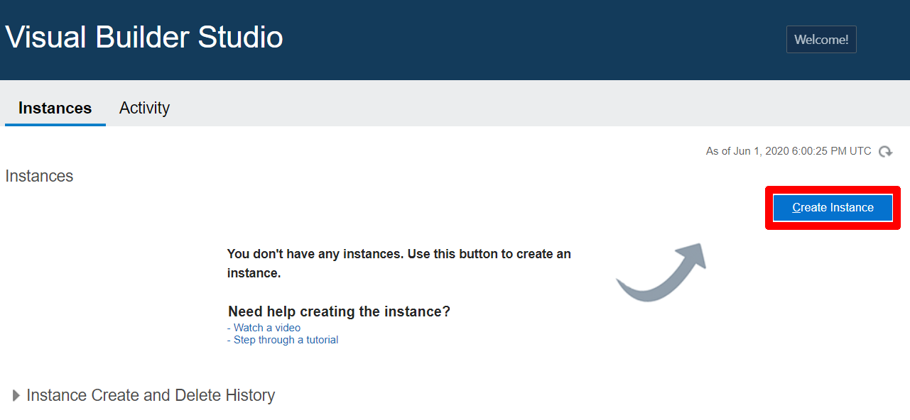

3. On the next screen provide an instance name and fill in the region you want to create your instance in, then click **Next**:

  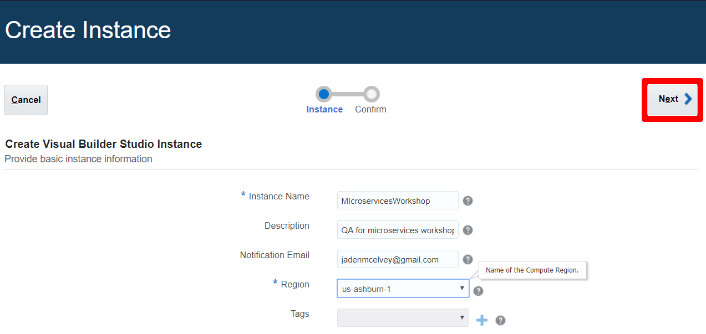

4. Check the selections from the previous screen and click **Create**:

  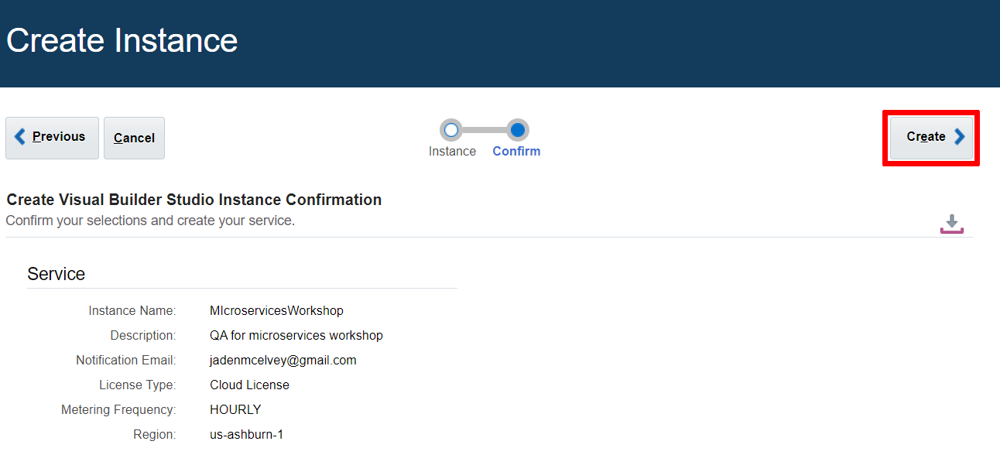

5. Instance creation will start creating the service. This can be seen on the status screen:

  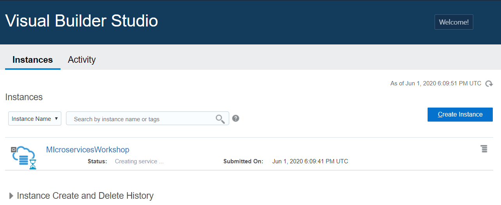

This process will take some time. Proceed to the next step to gather the data you'll need to configure the Developer Cloud Service Instance when it is ready.

## **Step 2**: Gather key config data from the Oracle Cloud Tenancy

Before we are able to configure a Developer Cloud Service Instance, let’s gather some key info about our OCI tenancy that will be required throughout the rest of the lab. We recommend that you create a `txt` file where you can store the basic info you will be required to use several times during this lab:

  - Tenancy OCID
  - User OCID
  - Private Key
  - Public Key
  - Fingerprint
  - Auth Token
  - Compartment OCID
  - Object Storage Namespace

1. From the Oracle Cloud Infrastructure interface menu, click **Administration \> Tenancy Details**:

  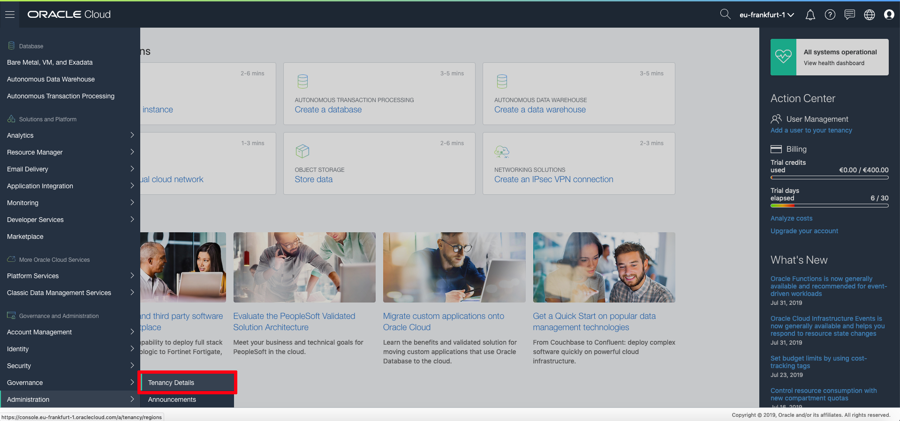

2. In the tenancy information area, select the **Copy** link to copy the OCID for tenancy and don’t forget to make a note in a text file. Also copy the Object Storage Namespace under the Object Storage Setting area and don’t forget to make a note in a text file.

  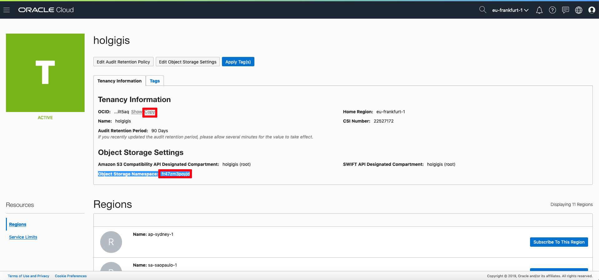

3. From the menu click **Identity \> Users**:

  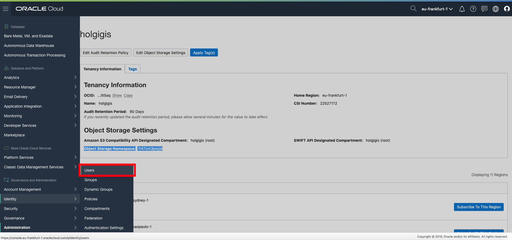

4. In the Users area, click the three dots on the right side and **Copy OCID** for your email address user (remember this user has admin role in OCI tenancy) to copy the user’s OCID. Don’t forget to make a note in a text file.

  

5. Now we will create an Auth token for the user by using a public and private key. We will provide you with two already created .pem keys to download in:

  [https://github.com/oraclespainpresales/GigisPizzaHOL/tree/master/microservices/Credentials](https://github.com/oraclespainpresales/GigisPizzaHOL/tree/master/microservices/Credentials)

6. First thing you need to do is view the content of the private key and copy the private key to the txt file. Then do the same with the public key and copy the public key to your clipboard.

  

7. Now click on your email user and you will be directed to a details screen, click **Api Keys** and then click **Add Public Key**.

  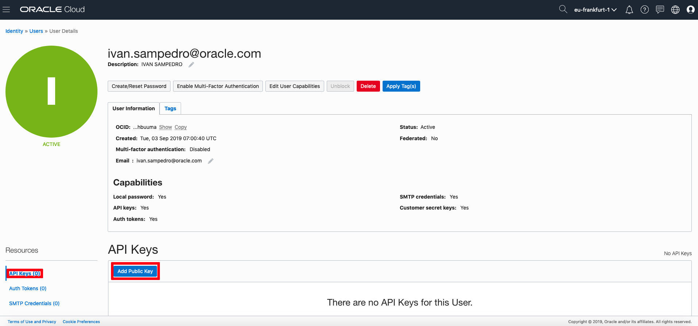

8. Now select **Paste Public Keys** and paste the key in the popup window. Make sure you have copied the contents of public.pem and not private.pem. Click **Add**.

  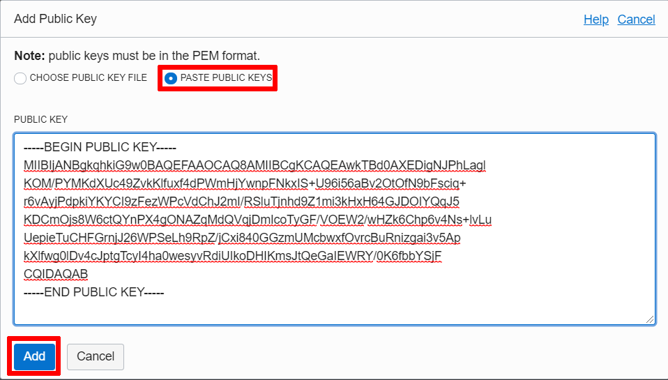

9. Now copy the generated fingerprint as it will be used later. Don’t forget to make a note in a txt file.

  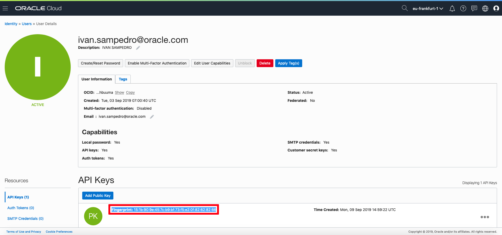

10. Now create parameter required (AuthToken) by clicking in Auth Tokens under the Resources area, click **Generate Token** and  provide a description:

  *IMPORTANT REMINDER: AFTER YOU CLICK THE Generate Token Button, COPY THIS AUTHTOKEN AND KEEP IT SAFE AS IT CANNOT BE FOUND LATER*

  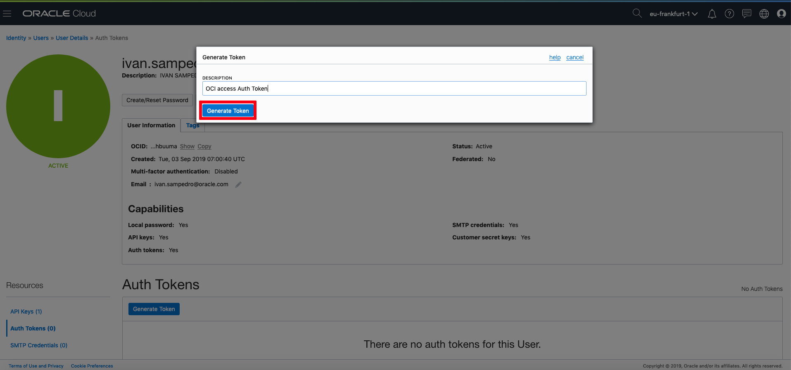

  *IMPORTANT: Copy the Generated Token in a txt file and keep it safe as we will require it later:*

  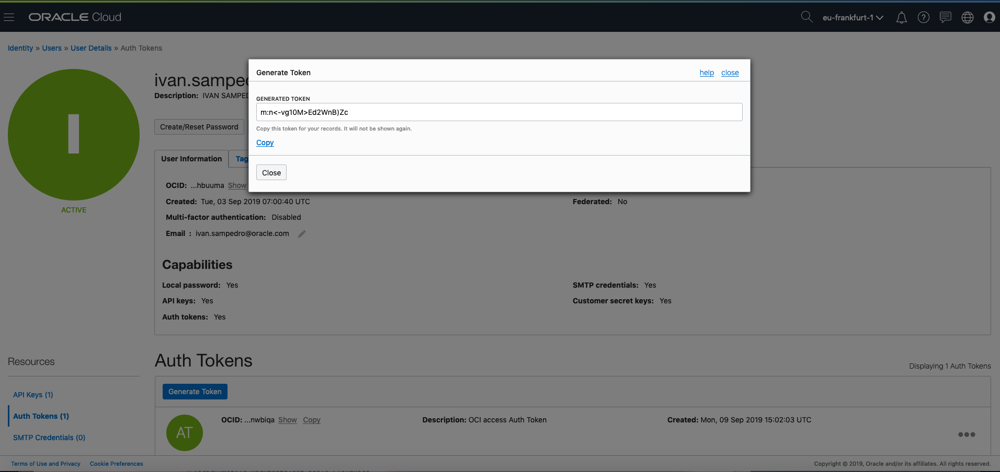

11. Now we have to create a new Compartment as currently we only have the root compartment in tenancy by default. From the Menu click **Identity \> Compartments**:

  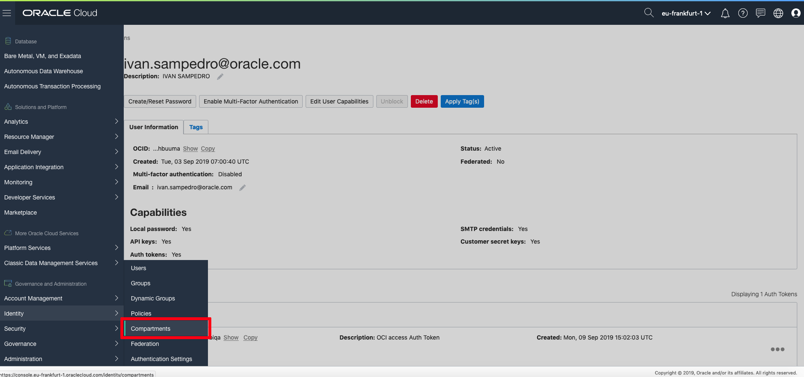

12. Click **Create Compartment** to open the Create Compartment dialog, and fill the Name field (for example
HandsOnLab), Description and Parent Compartment (it must be root referred with tenancy name) and click **Create Compartment**:

  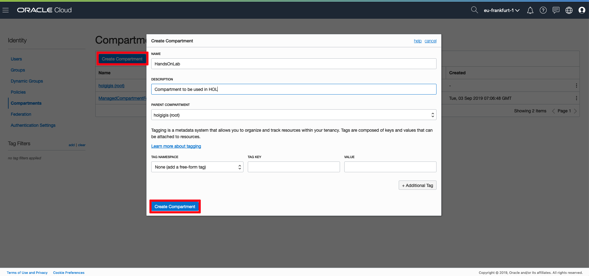

13. Click the compartment name you have just created (HandsOnLab):

  

14. And click **Copy** to copy the Compartment OCID. Don’t forget to make a note in a txt file.

  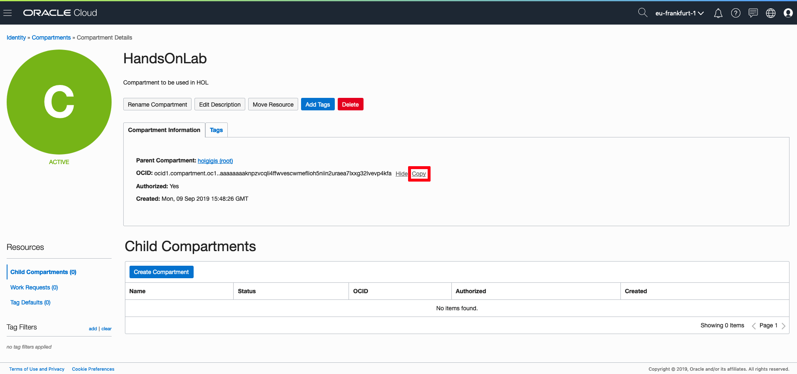

This concludes the list of OCI tenancy parameters you will require to run next section.

## **Step 3**: Configure a Developer Cloud Service Instance

Now let’s check that Developer Cloud Service has been created so that we can configure it.

1. Check updated status by clicking on the refresh () icon:

  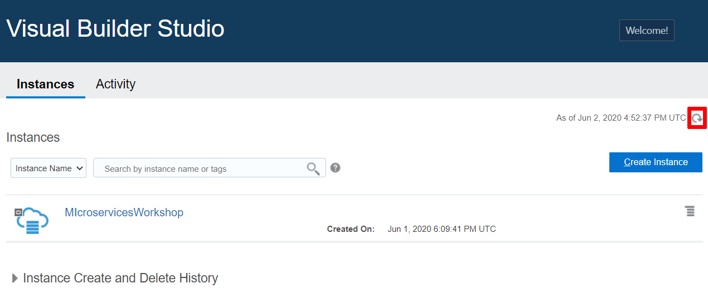

2. Once the Developer Cloud Service instance has been provisioned, click on the right side menu and select: “Access Service Instance”:

  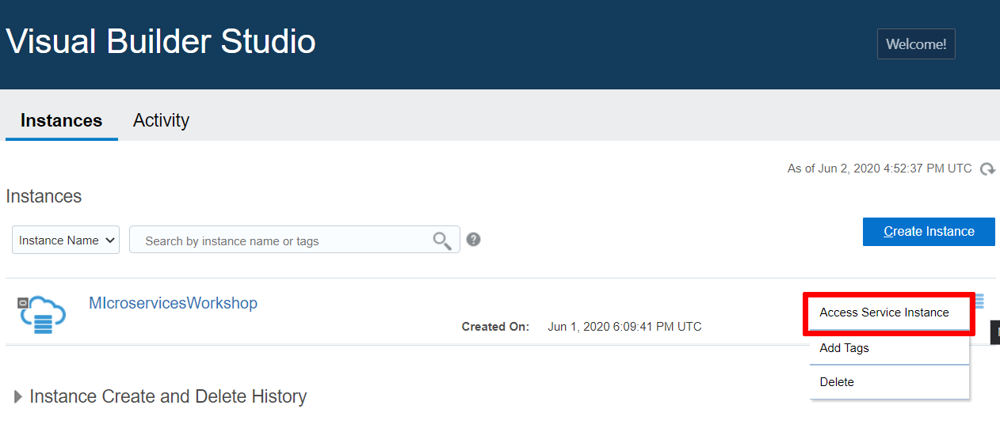

3. Click **OCI Account** and then click **Connect**.

  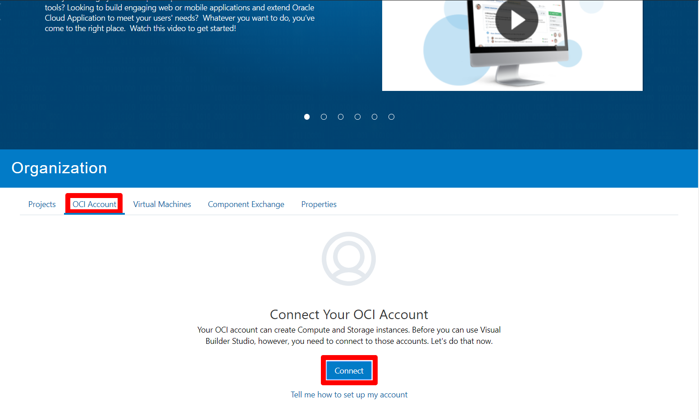

4. Select OCI for Account type and fill in the rest of the fields. Leave passphrase blank and also check the box below. Then click **Validate** and if your compute and storage connections are correct, click **Save**.

  

You can proceed to the next lab.

## Want to Learn More?

* [Oracle Developer Cloud Service Documentation](https://docs.oracle.com/en/cloud/paas/developer-cloud/index.html)

## Acknowledgements
* **Authors** -  Iván Postigo, Jesus Guerra, Carlos Olivares - Oracle Spain SE Team
* **Last Updated By/Date** - Tom McGinn, April 2020

See an issue?  Please open up a request [here](https://github.com/oracle/learning-library/issues). Please include the workshop name and lab in your request.
